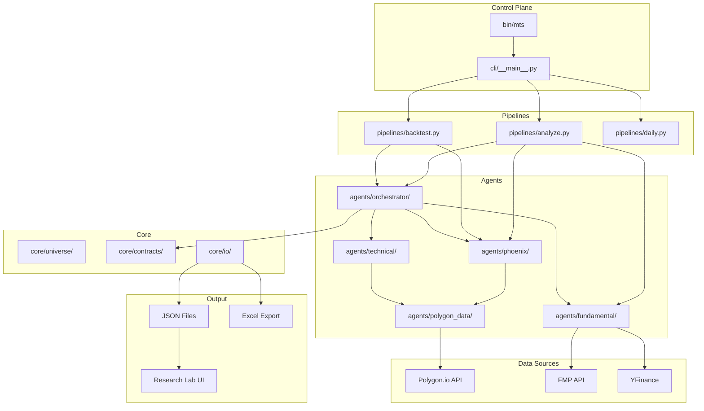
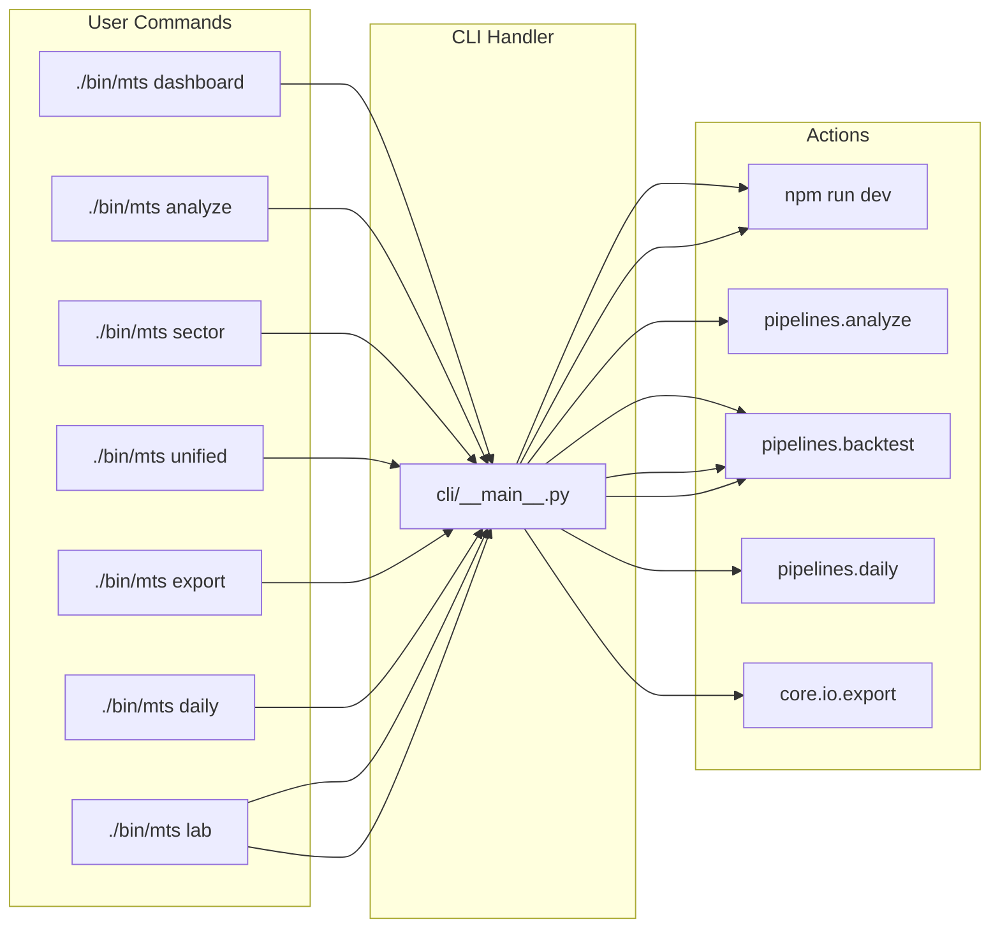
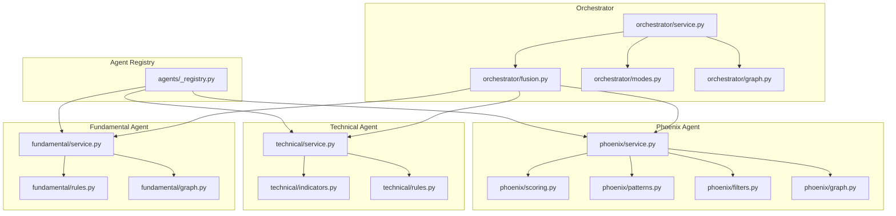
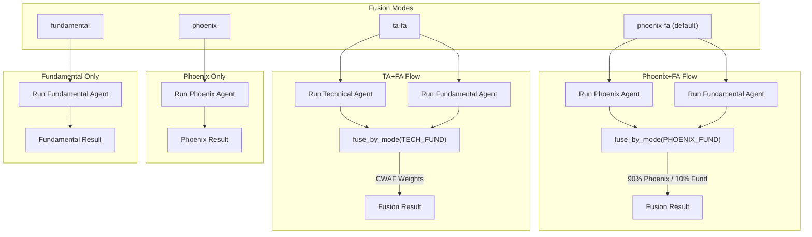
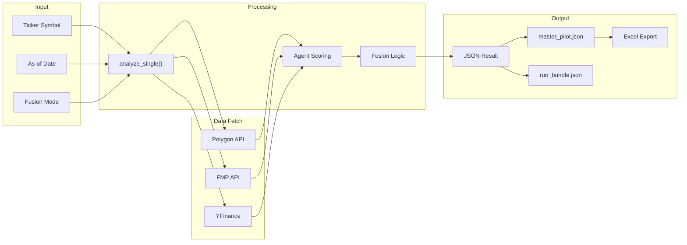
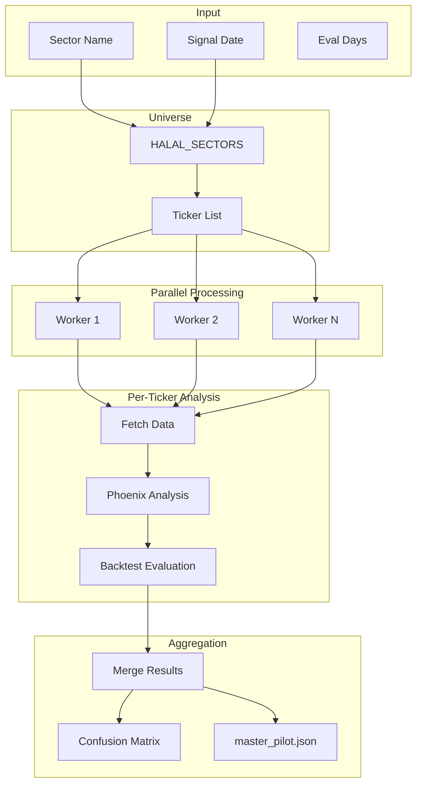
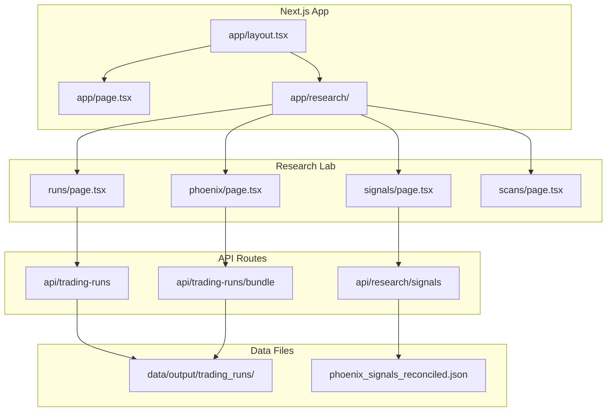
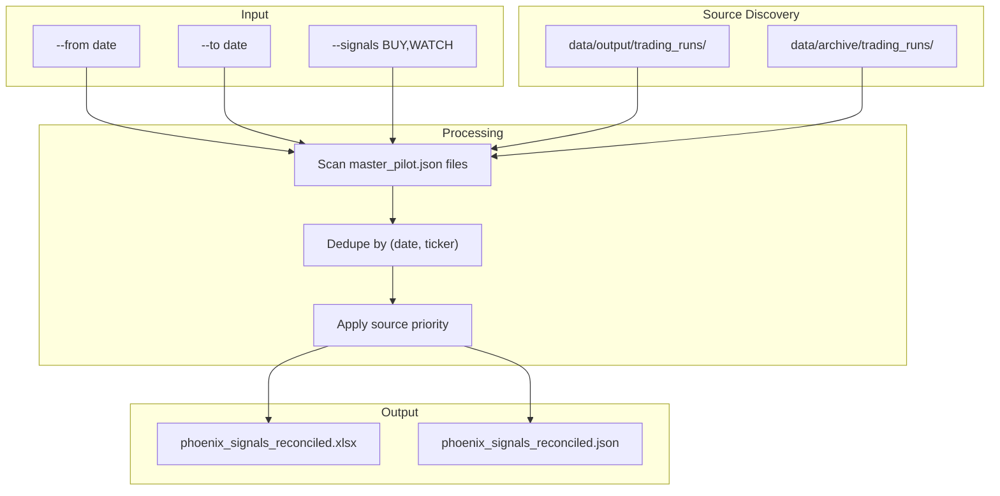

# MyTradingSpace Architecture

## System Overview

## Command Flow

## Agent Architecture

## Fusion Modes

## Data Flow

## Backtest Pipeline

## Dashboard Architecture

## Export Flow

## File Structure

```mermaid
graph TD
    ROOT["MyTradingSpace/"]
    
    ROOT --> BIN["bin/mts"]
    ROOT --> CLI["cli/"]
    ROOT --> PIPE["pipelines/"]
    ROOT --> AGENTS["agents/"]
    ROOT --> CORE["core/"]
    ROOT --> APPS["apps/"]
    ROOT --> DATA["data/"]
    ROOT --> DOCS["docs/"]
    
    CLI --> CLI_MAIN["__main__.py"]
    
    PIPE --> P_ANALYZE["analyze.py"]
    PIPE --> P_BACKTEST["backtest.py"]
    PIPE --> P_DAILY["daily.py"]
    
    AGENTS --> A_PHOENIX["phoenix/"]
    AGENTS --> A_TECH["technical/"]
    AGENTS --> A_FUND["fundamental/"]
    AGENTS --> A_ORCH["orchestrator/"]
    AGENTS --> A_POLY["polygon_data/"]
    AGENTS --> A_REG["_registry.py"]
    
    CORE --> C_UNIVERSE["universe/"]
    CORE --> C_DATA["data/"]
    CORE --> C_IO["io/"]
    CORE --> C_CONTRACTS["contracts/"]
    
    APPS --> DASHBOARD["backtest-dashboard/"]
    APPS --> OPENCLAW["openclaw/"]
    
    DATA --> D_INPUT["input/"]
    DATA --> D_OUTPUT["output/"]
```

