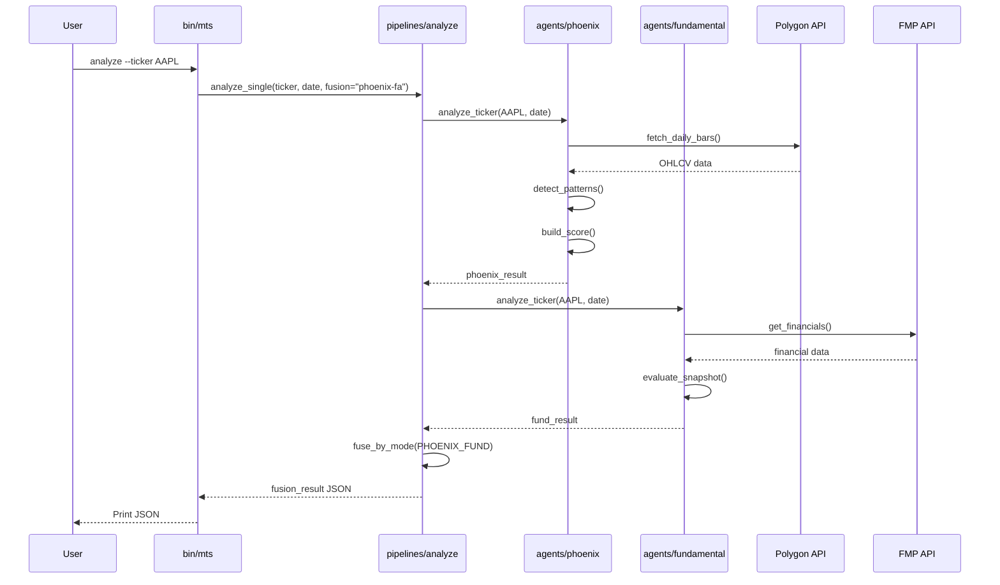
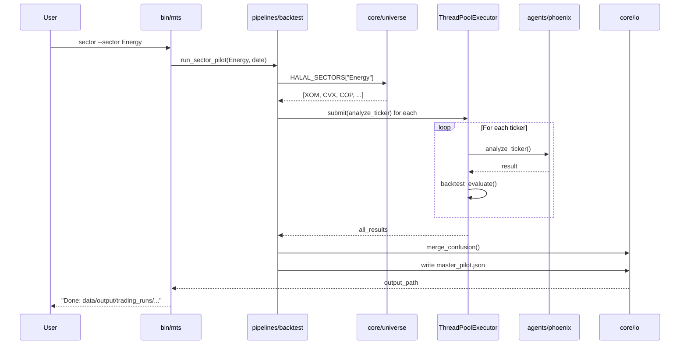
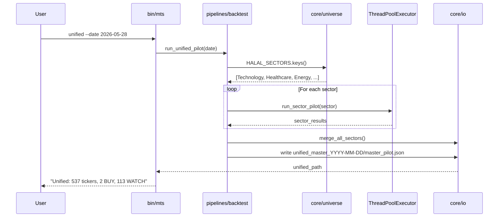
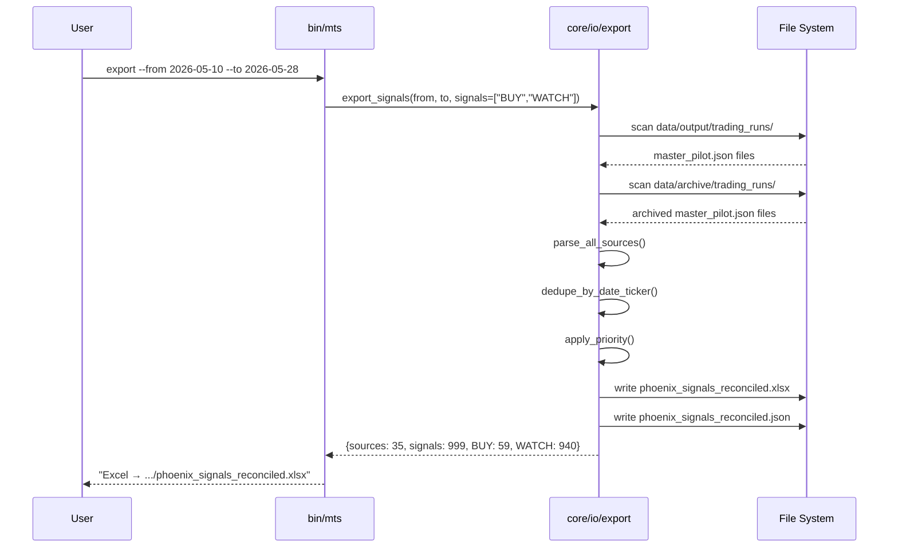
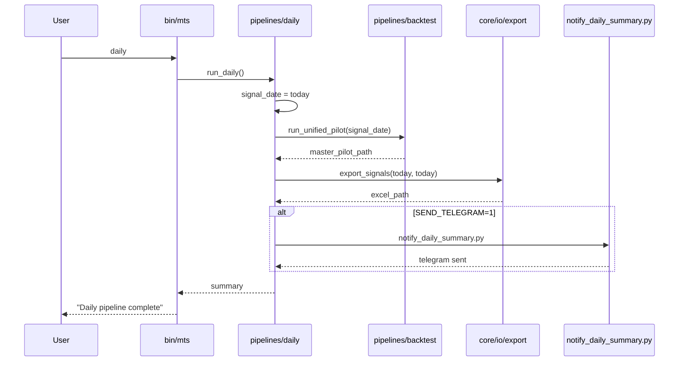
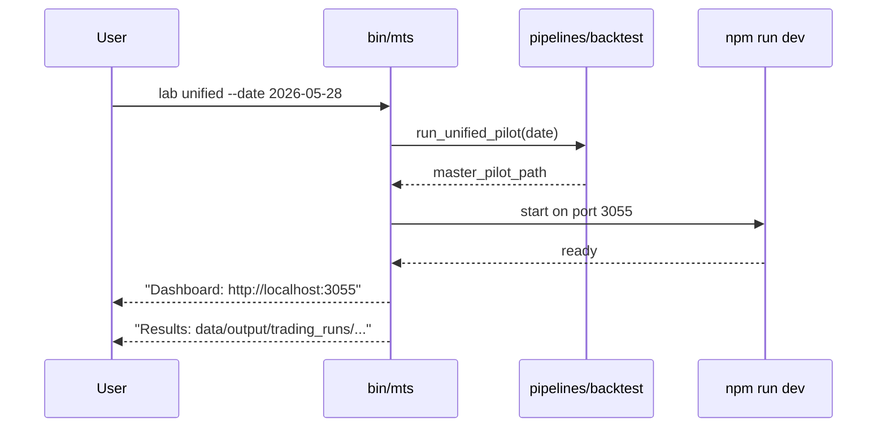
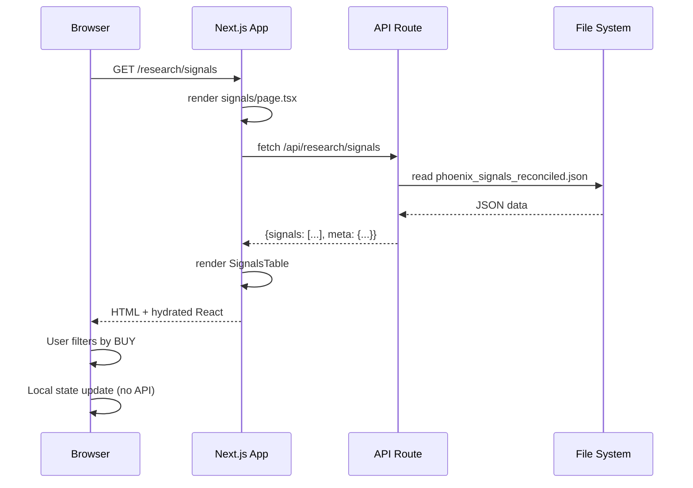
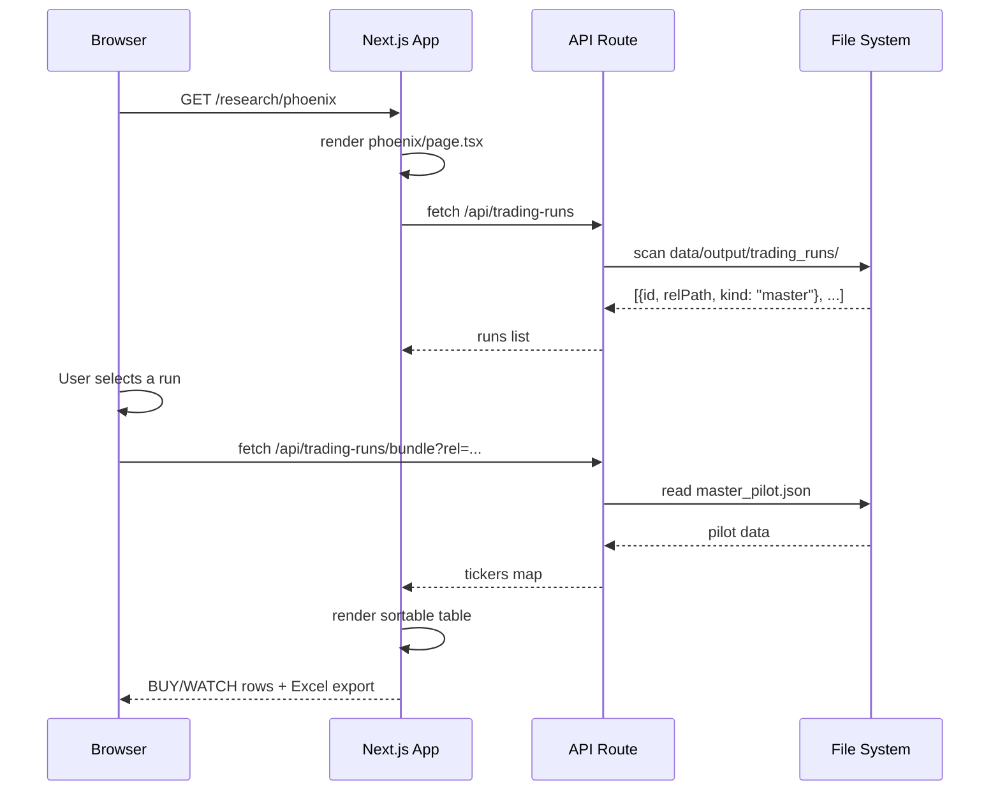

# Usage Scenarios

## Scenario 1: Single Ticker Analysis

**Command:** `./bin/mts analyze --ticker AAPL --date 2026-05-28`

## Scenario 2: Sector Backtest

**Command:** `./bin/mts sector --sector Energy --date 2026-05-28`

## Scenario 3: Unified All-Sector Backtest

**Command:** `./bin/mts unified --date 2026-05-28`

## Scenario 4: Export Signals

**Command:** `./bin/mts export --from 2026-05-10 --to 2026-05-28`

## Scenario 5: Daily Pipeline

**Command:** `./bin/mts daily`

## Scenario 6: Lab Mode (Backtest + Dashboard)

**Command:** `./bin/mts lab unified --date 2026-05-28`

## Scenario 7: Dashboard Browse

**User Action:** Open http://localhost:3055/research/signals

## Scenario 8: Phoenix Pilot Viewer

**User Action:** Open http://localhost:3055/research/phoenix

