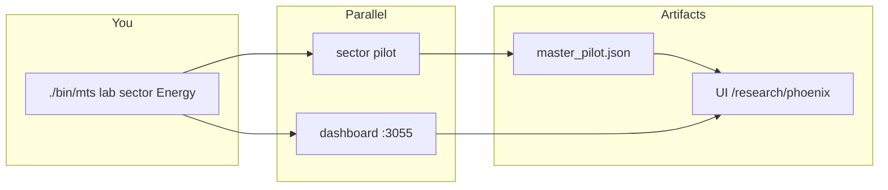

# Production plan — one command surface, clean layout, multi-agent ready

**Goal:** Stop asking “run the dashboard / run sector backtest.” You run **3–5 commands** from repo root; everything else is internal.

**Status:** Phase 1–5 done; Phases 6–7 pending  
**Last updated:** 2026-05-30

---

## 1. What you run day-to-day (target)

From `MyTradingSpace/` after `./bin/mts` exists:

| You want to… | Command |
|--------------|---------|
| **Open dashboard only** | `./bin/mts dashboard` |
| **One sector backtest** | `./bin/mts sector --sector Energy --date YYYY-MM-DD` |
| **All sectors (unified)** | `./bin/mts unified --date YYYY-MM-DD` |
| **Sector test + dashboard together** | `./bin/mts lab sector --sector Energy --date YYYY-MM-DD` |
| **Full universe + dashboard** | `./bin/mts lab unified --date YYYY-MM-DD` |
| **Export BUY/WATCH Excel** | `./bin/mts export --from YYYY-MM-DD --to YYYY-MM-DD` |
| **Single ticker analyze** | `./bin/mts analyze --ticker AAPL --date YYYY-MM-DD` |

`lab` = backtest in background + dashboard on `:3055` (same terminal or split panes).  
Optional: `./bin/mts stop` to kill dashboard + stale pilots.

**Parallel use:** Open two terminals — `./bin/mts dashboard` once, then `./bin/mts sector …` as often as you need; dashboard hot-reloads from `data/output/trading_runs/`.

---

## 2. Why it feels scary today

| Problem | Today | Fix |
|---------|--------|-----|
| Too many entry points | 40+ scripts, 2 CLIs (`run_trading.py` + `pipelines`) | One wrapper: `bin/mts` → `pipelines` / `run_trading.py` |
| Dashboard buried | `cd backtest-dashboard && npm run dev` | `bin/mts dashboard` |
| UI clutter | 6+ pages, legacy prediction JSON | Split **Research Lab** vs future **Wealth** home |
| Generated data in git | Was 700+ tracked files | Done: single `.gitignore`, output local only |
| Agents + scripts mixed | `scripts/backtests/` 1700-line files | Pipelines call engines; engines shrink over time |
| No visual map | Scattered READMEs | `STRUCTURE.md` + this plan + `docs/SCRIPTS.md` |

---

## 3. Target repository layout (production)

```
MyTradingSpace/
├── bin/
│   └── mts                    # ONLY user-facing runner (bash → python -m cli)
├── cli/                       # argparse: dashboard | sector | unified | lab | export | analyze
│   └── __main__.py
├── agents/                    # One folder per agent (+ adapter.py, no cross-imports)
├── core/                      # contracts, paths, io, export (no agent logic)
├── pipelines/                 # batch workflows (delegate to engines today)
├── apps/
│   ├── backtest-dashboard/    # move from root; Research Lab UI
│   └── openclaw/              # move from root; thin skills → bin/mts
├── data/
│   ├── input/                 # committed universe
│   └── output/                # gitignored runs
├── docs/                      # specs, playbooks, SCRIPTS.md
├── tests/
└── archive/                   # retired scripts (never run in prod)
```

**Rule:** New agents add `agents/<id>/` + registry entry — **no new top-level scripts**.

---

## 4. `bin/mts` design (concrete)

```bash
#!/usr/bin/env bash
# bin/mts — MyTradingSpace control plane
ROOT="$(cd "$(dirname "$0")/.." && pwd)"
cd "$ROOT"
PY="${MYTRADING_PYTHON:-$ROOT/.venv/bin/python}"
exec "$PY" -m cli "$@"
```

`cli/__main__.py` subcommands:

| Subcommand | Calls |
|------------|--------|
| `dashboard [--port 3055]` | `npm run dev` in `apps/backtest-dashboard` |
| `sector` | `pipelines sector` |
| `unified` | `pipelines unified` |
| `analyze` | `pipelines analyze` |
| `export` | `core/io/export.py` (wraps BUY/WATCH reconciler) |
| `lab sector\|unified` | fork backtest + `dashboard` (wait for master_pilot or open UI immediately) |
| `daily` | `pipelines daily` (OpenClaw / cron) |

Env: `.env` loaded once in `cli`. Logs always under `data/output/trading_runs/logs/`.

---

## 5. Dashboard refactor (two products, one app)

### Phase D1 — Navigation cleanup (quick win)

```
/research              → hub (cards: Signals, Runs, Phoenix, Scans)
/research/signals      → reconciled BUY/WATCH dump + Excel download
/research/runs         → today’s /trading-runs
/research/phoenix      → today’s /phoenix-watch-buy
```

Hide or redirect: legacy home tabs, `/halal`, `/sectors` (unless you still use prediction batch).

### Phase D2 — Wealth home (later)

```
/                      → portfolio, invested $, open P&L
/journal               → trade journal CRUD
/research/*            → backtests unchanged
```

Data: `data/portfolio/positions.json`, `trades.json` (gitignored or encrypted — not backtest output).

---

## 6. Backtest / sector testing workflow



**Periodic schedule (optional):** LaunchAgent already in `openclaw/scripts/install_daily_launchd.sh` → point at `bin/mts daily`. Dashboard stays manual or always-on Mac with `bin/mts dashboard` in LaunchAgent.

---

## 7. Implementation phases (one at a time)

### Phase 0 — Done
- [x] `core/`, `pipelines/`, agent registry
- [x] Single `.gitignore`, untrack generated data
- [x] `docs/SCRIPTS.md`, `STRUCTURE.md`

### Phase 1 — **Command surface** (do next, ~1 day)
- [x] Add `bin/mts` + `cli/__main__.py`
- [x] `mts dashboard`, `mts sector`, `mts unified`, `mts lab`, `mts stop`, `mts export`
- [x] Update `docs/SCRIPTS.md` → “use `bin/mts` first”
- [x] OpenClaw skills point to `bin/mts`

**Status:** Done (2026-05-30)

**Acceptance:** You can run sector + dashboard without Cursor.

### Phase 2 — **Export & signals** (~1 day)
- [x] `core/io/export.py` — BUY + WATCH reconciler (active + archive sources)
- [x] `mts export --from --to --signals BUY,WATCH`
- [x] `/research/signals` page + API

**Status:** Done (2026-05-30)

### Phase 3 — **Move apps** (~1 day, low risk)
- [x] `backtest-dashboard/` → `apps/backtest-dashboard/`
- [x] `openclaw/` → `apps/openclaw/`
- [x] Symlinks at old paths for backward compat
- [x] Fix Vercel `deploy.yml` paths

**Status:** Done (2026-05-30)

### Phase 4 — **Dashboard Research Lab** (~2 days)
- [x] Shared layout + sidebar (`app/research/layout.tsx`)
- [x] Consolidate pages under `/research/*` (signals, phoenix, runs, scans)
- [x] Redirects from old paths (`/phoenix-watch-buy` → `/research/phoenix`, etc.)
- [x] Main sidebar simplified — Research Lab as single entry point

**Status:** Done (2026-05-30)

### Phase 5 — **Engine shrink** (ongoing)
- [x] `backtests/common.py` → `core/universe/` (shim remains for compat)
- [x] Polygon → `core/data/polygon.py` (re-export from `agents/polygon_data`)
- [x] Deprecate `scripts/run_*` prediction batch → `archive/scripts/prediction-legacy/`
- [x] `run_trading.py` kept for advanced use; `bin/mts` for daily ops

**Status:** Done (2026-05-30)

### Phase 6 — **Wealth + journal** (when you’re ready)
- [ ] `data/portfolio/` schema
- [ ] `/` portfolio, `/journal`
- [ ] “Open trade from signal” on `/research/signals`

### Phase 7 — **Multi-agent scale**
- [ ] New agent = folder + `adapter.py` + `_registry.py` + spec in `docs/specs/`
- [ ] CI: pytest + smoke `mts analyze AAPL`
- [ ] Optional fusion registry in orchestrator (no new scripts)

---

## 8. What gets deleted / archived (not deleted from disk)

| Retire from daily use | Goes to |
|----------------------|---------|
| `scripts/run_halal_predictions.py`, `run_backtest_excel.py`, … | `archive/scripts/` (done partially) |
| `scripts/run_orchestrator_tickers.py` | shim → `mts analyze` |
| Nested `.gitignore` | removed (done) |
| Root loose specs | `docs/specs/` (done) |
| Legacy dashboard JSON in `app/data/` | gitignored (done) |

**Keep until parity proven:** `scripts/backtests/run_halal_*`, `run_master_data_parallel_pilot.py` (called by pipelines).

---

## 9. Parallel run cheat sheet (after Phase 1)

**Terminal 1 — dashboard (leave running):**
```bash
cd MyTradingSpace && ./bin/mts dashboard
```

**Terminal 2 — sector tests (repeat per sector):**
```bash
./bin/mts sector --sector Energy --date 2026-05-28
./bin/mts sector --sector "Information Technology" --date 2026-05-28
```

**Or one shot — unified + dashboard:**
```bash
./bin/mts lab unified --date 2026-05-28
# → http://localhost:3055/research/phoenix
```

---

## 10. Success criteria (production-ready)

- [ ] **One** documented runner (`bin/mts`) for humans and OpenClaw
- [ ] Dashboard starts in one command; reads local `data/output/` only
- [ ] No generated artifacts in git push
- [ ] New agent needs **zero** new root scripts
- [ ] `/research/*` is the only backtest UI surface
- [ ] You can run sector analysis weekly without AI assistance

---

## 11. Recommended order for you

1. **Phase 1** — `bin/mts` (biggest daily win)  
2. **Phase 2** — export + signals page (your reconciled Excel ask)  
3. **Phase 4** — dashboard nav cleanup (less scary UI)  
4. **Phase 3** — move `apps/` (structure)  
5. **Phase 6** — wealth/journal when trades are real  

Say **“implement Phase 1”** to start building `bin/mts` in the repo.
